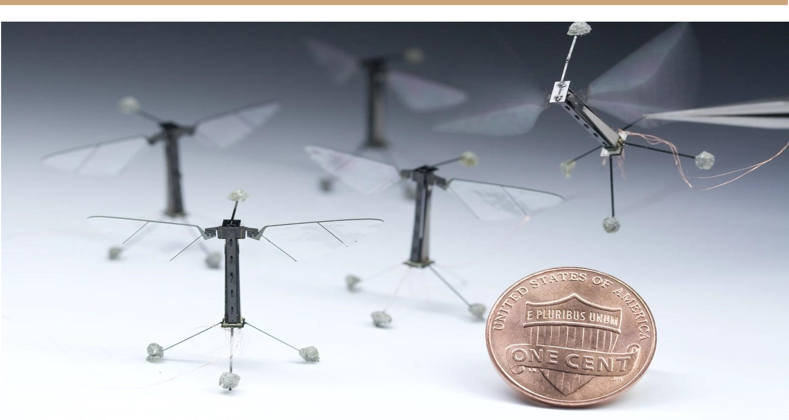

# Zoemende Beestjes 

Dauwdruppels op het gras, een lentezonnetje dat opkomt en vrolijk insecten gezoem. Het hooikoortsseizoen is weer aangebroken, en hoe mooi de bloeiende natuur ook is, voor velen zijn die rondzwevende pollen geen pretje. En wie is hiervan de aanstichter? De bij.  

Misschien goed voor degenen met een pollenallergie want bijen worden langzamerhand steeds meer en meer bedreigd. Onderzoekers schetsen dat bijen sterven met de snelheid van een massa uitsterving, binnen tientallen jaren kan het klaar zijn. In Amerika bijvoorbeeld was de bijenpopulatie in 2018 met 40,7% gedaald. Nu is dat voor die lepel honing in de thee of de hooikoorts niet zo’n ding, maar bijen zijn veel meer dan rond zoemende beestjes.  

Met dat rond zoemen voeren ze een essentiële taak uit in ecosystemen over de hele wereld: bestuiving. Oftewel de bevruchting van 90% van de planten, bomen en andere organismen. Hiermee is de mens ook enorm afhankelijk van de bij: één-derde van ons dagelijkse geconsumeerde voedsel heeft bestuiving door bijen nodig. Met de zeer schadelijke gevolgen, als voedseltekorten en instorting van ecosystemen, in het achterhoofd, is het essentieel om te kijken naar oplossingen.  
Waar het in veel andere sectoren ook een oplossing was, kan ook hier kunstmatige intelligentie een uitkomst bieden: een robot-bij.  
 
# Wat is een robot-bij? 

Een robot-bij is een variant van een kleine drone die met behulp van kunstmatige intelligentie zelfstandig de functies van een normale bij kunnen overnemen. Om dit goed te kunnen doen zijn er wat voorwaarden: 

1.	Ten eerste moet de robot-bij kunnen vliegen, aanstuurbaar zijn en bloemen kunnen herkennen. Zo moet het bloemen kunnen onderscheiden van bijvoorbeeld onkruid of planten die zichzelf bestuiven. Hiervoor wordt gebruik gemaakt van een bekend begrip in kunstmatige intelligentie: machine-learning. Dit zijn systemen die zelf leren aan de hand van data. In het geval van de robot-bij heeft deze een bepaald beeld van iets, van een bloem bijvoorbeeld. Dit beeld, of één die erop lijkt, wordt gegeven als input. Vervolgens moet de robot-bij dit beeld kunnen herkennen in de natuur en dit beeld ook eventueel daarop aanpassen.  

2.	Ten tweede moet de robot-bij met behulp van camera’s en sensoren een bepaald gebied kunnen herkennen. Dit gaat ook weer samen met het begrip machine-learning omdat het exact een bepaald gebied moet bestuiven aan de hand van gegeven data. 

3.	Ten derde moet de robot-bij alle bloemen kunnen vinden en berekenen met welke snelheid en hoek hij ze moet benaderen. 

4.	Ten vierde moet de robot-bij kunnen herkennen of de bloem wel of niet bestuift moet worden. Indien dit niet zo is moet het naar de volgende bloem van een bepaald gebied kunnen gaan en als er geen bloemen zijn die bestuift moeten worden, moet het naar een geheel nieuw gebied gaan met nieuwe bloemen. Zijn er wel bloemen die bestuift moeten worden dan moet het eerst controleren of die bloemen bestuift kunnen worden. Sommige bloemen kunnen bijvoorbeeld alleen door bepaalde vlinders of andere dieren bestuift worden.  

5.	Tenslotte moet de robot-bij de bloem ook daadwerkelijk kunnen bestuiven en hierna doorgaan naar de volgende bloem.  
Het is dus nog niet zo makkelijk, het gedrag van een ogenschijnlijk simpel beestje na te bootsen. Maar gezien de noodzaak is het geruststellend dat de hedendaagse technologie hiertoe in staat is. Want ook al wordt kunstmatige intelligentie vaak gezien als een killer robot die de wereld zal verwoesten, is er hier toch maar weer een schattige robot versie van een bij geschetst die juist onze wereld kan redden. En misschien nog wel het belangrijkste van alles; ze brengen geen pollenallergie met zich mee! 
 
# Bronnen

Chen, Y., & Li, Y. (2019). Intelligent autonomous pollination for future farming-a micro air vehicle conceptual framework with artificial intelligence and human-in-the-loop. IEEE Access, 7, 
1–11. https://doi.org/10.1109/access.2019.2937171 

Jacobo, J. (2019, 10 juli). Nearly 40% decline in honey bee population last winter 
“unsustainable,” experts say. ABC News. https://abcnews.go.com/US/40-decline-honeybee-population-winter-unsustainable-experts/story?id=64191609#:%7E:text=Data%20shows%20bee%20populations%20dwindling%20more%20and%20more%20each%20year&text=For%20the%20entire%20year%20%2D%2D,seen%20since%202006%2C%20McArt%20said 

Rise Of The Robot Bees: Tiny Drones Turned Into Artificial Pollinators. (2017, 3 maart). NPR. 
https://choice.npr.org/index.html?origin=https://www.npr.org/sections/thesalt/2017/03/03/517785082/rise-of-the-robot-bees-tiny-drones-turned-into-artificialpollinators?t=1610551070442

RoboBees: Autonomous Flying Microrobots. (2019, 3 december). Wyss Institute. 
https://wyss.harvard.edu/technology/robobees-autonomous-flying-microrobots/ 

University of Ottawa. (2020, 6 februari). Why bumble bees are going extinct in time of “climate chaos”. Phys Org. https://phys.org/news/2020-02-bumble-bees-extinct-climatechaos.html 
