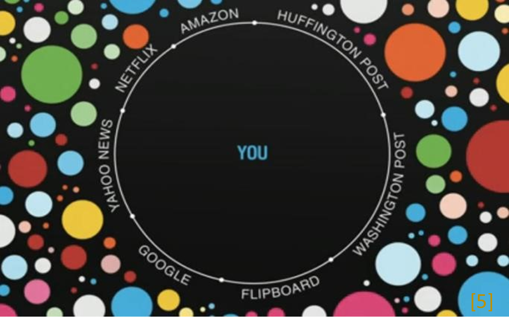
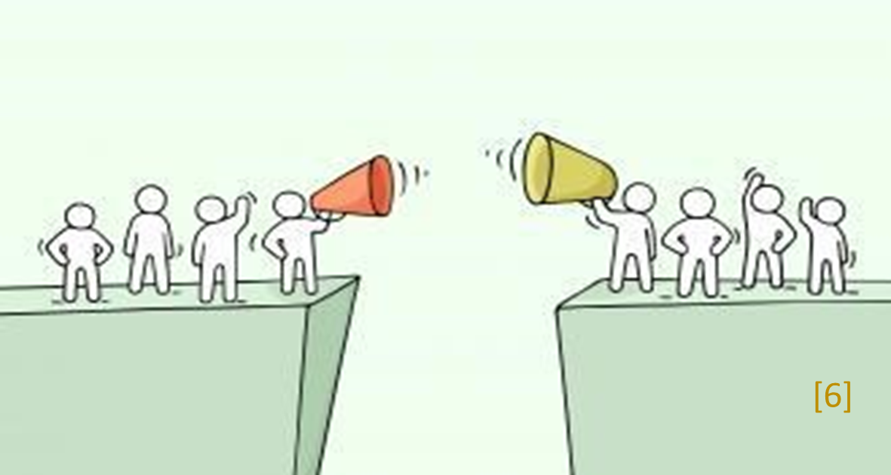

Een steeds groter deel van ons leven speelt online af en het internet is (bijna) niet meer weg te denken. Overal om ons heen wordt gebruik gemaakt van AI-technieken, of het nu tijdens het shoppen, op de werkvloer of rond een verkiezingsperiode is. Zo geeft een zoekactie op internet je meteen toegang tot de gevraagde informatie, waarbij algoritmes in veel gevallen bepalen wat voor jou interessant is om te zien. Op deze manier lijken deze algoritmes, bewust of onbewust, je keuzeruimte te vormen. Dit zorgt ervoor dat je enkel gepersonaliseerde advertenties krijgt op basis van een persoonlijke data-analyse. Hierdoor blijf je, volgens Eli Pariser, rondcirkelen in een gefilterde omgeving, wat hij heeft definieert als de filter bubbel [1]. 

# Gefilterde informatie 

De invloed van AI zal waarschijnlijk alleen nog maar meer worden, hierdoor zullen met name Tech-bedrijven steeds machtiger worden Dit gaat samen met een aantal risico s voor de samenleving. Op maatschappelijk niveau schuilt onder andere het gevaar dat er een tweedeling in de maatschappij kan ontstaan. Het is namelijk van belang om andermans mening te leren kennen om volledig te ontwikkelen als mens. Als dit echter niet mogelijk is, neigen mensen eerder naar extreme visies [2]. Dit zie je gebeuren als mensen in hun eigen bubbel blijven rondcirkelen. Hierdoor bestaat de kans dat mensen elkaars kijk niet meer accepteren en dat grote groepen in de samenleving steeds meer tegenover elkaar komen te staan. Dit proces, van het wij-zij-denken, kan mogelijk escaleren tot vijandschap en geweld, ook wel polarisatie genoemd	  

# Consequenties van de polarisatie 

Deze polarisatie kan hevige consequenties hebben op de democratie zoals wij die nu kennen. Volgens Hans Bouttelier, hoogleraar polarisatie & veerkracht, is de democratie kwetsbaar en heeft deze onderhoud nodig [3]. Wanneer dit onvoldoende gebeurt, wordt de kwetsbaarheid steeds zichtbaarder. Twee duidelijke voorbeelden hiervan zijn beide rond een verkiezingsperiode in de VS Eén bij de verkiezingen in  en de ander meer recentelijk, namelijk de bestorming van het Capitool in 2021.
 
AI-algoritmes hadden een bepalende rol bij de verkiezingen in 2016. Zo werd een grote groep Afro-Amerikanen gericht benaderd door de Republikeinen. Zij ontvingen berichten waarin ze eraan werden herinnerd dat Hillary Clinton AfroAmerikanen per preda or had genoemd [4]. Dit was met het doel om de stemmen voor de Democratische partij te minimaliseren. Echter kon dit niet worden verdedigd, doordat deze berichten enkel zichtbaar waren voor deze bepaalde groep. Dit is een groot risico doordat mensen een eenzijdige mening vormen, zonder alle informatie te hebben en hierdoor tegen elkaar op worden gezet.  
 

Meer recent zien we een extreme vorm van polarisatie bij de bestorming van het Capitool. Aanhangers werden grotendeels aangespoord door de tweets en toespraken van Trump. De algoritmes van de platformen (waaronder Twitter) zijn erop ingesteld dat je berichten ziet die lijken op eerdere vormen van jouw activiteit. Hierdoor is het heel waarschijnlijk dat deze Trump aanhangers berichten binnen deze bubbel ontvingen en geen rekening meer hielden met andere partijen en waarheden. Dit escaleerde zo ver dat ze bereid waren om het Capitool te bestormen en dat laat zien hoeveel invloed deze platformen kunnen hebben.  

# Toekomst 

Kortom zien we dat onze wereld en informatietoevoer is veranderd door AI. Natuurlijk is het anders geregeld in Nederland, maar toch kunnen we bepaalde lessen trekken uit deze gebeurtenissen die voor ons eveneens relevant zijn. Zo zei Boutellier: “Tegenstellingen en conflicten zijn in principe geen probleem, maar ook hier kan het omslaan naar vijandschap.” [3]. Het grootste gevaar schuilt er namelijk in dat je niet altijd door hebt dat je gefilterde informatie ontvangt. Hierdoor geloven wij dat je altijd rekening moet houden met de ander, want ieder heeft een andere mening en mogelijk een andere bron van informatie 
 
# Referenties  

[1]	Pariser, E. (2011). The filter bubble: What the Internet  is hiding from you. Penguin UK.  
[2]	Zuiderveen Borgesius, F., Trilling, D., Möller, J., Bodó,  B., De Vreese, C. H., & Helberger, N. (2016). Should we worry about filter bubbles?. Internet Policy Review. Journal on Internet  Regulation, 5(1). doi: https://doi.org/10.14763/2016.1.401  
[3]	Schouten, D. & De Waal, B. (2021, 12 januari). Welke  lessen Nederland kan trekken uit de bestorming van het Capitool: 'Ook hier kan het omslaan'. Geraapleegd op 17 januari 2021 op https://eenvandaag.avrotros.nl/item/welkelessen-nederland-kan-trekken-uit-de-bestormingvan-het-capitool-ook-hier-kan-het-omslaan/  
[4]	Zuiderveen Borgesius, F. J., Möller, J., Kruikemeier, S.,  Ó Fathaigh, R., Irion, K., Dobber, T., Bodo, B., & de Vreese, C. (2018). Online Political Microtargeting: Promises and Threats for Democracy. Utrecht Law Review, 14(1), 82. doi: 
https://doi.org/10.18352/ulr.420  
[5] Bron afbeelding:  https://www.smithsonianmag.com/innovation/h ave-scientists-found-a-way-to-pop-the-filterbubble-180948265/
[6] Bron afbeelding: https://www.buurtwijs.nl/content/e-learningnieuw-tool-tegen-polarisatie
[7] Bron afbeelding: https://www.omroepwest.nl/nieuws/4190178/Amerikadeskundige-Willem-Post-over-bestormingCapitool-Ik-werd-er-stil-van 
 
 
Blog Human(e) AI, 24-01-2021,  
