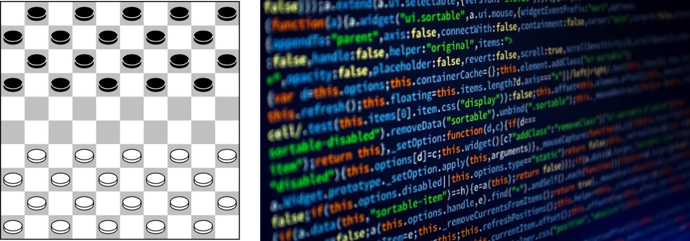
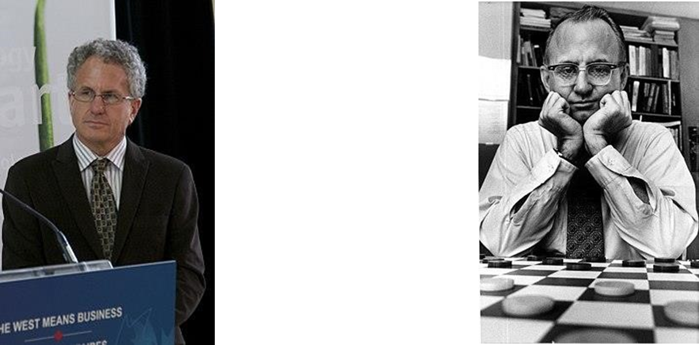

Omdat wij zelf uiterst fanatieke dammers zijn en veel dammen op de computer, schrijven wij nu deze blog. Dammen is een spel dat wordt gespeeld met een bord met 100 vakjes die afwisselend zwart en wit zijn. Je speelt het spel met twee spelers. Allebei de spelers hebben 20 damschijven, de ene heeft witte damschijven de andere zwarte damschijven. Voor het begin van het spel worden alle witte damschijven op de zwarte vlakjes van de onderste 4 rijen van het bord gelegd. De zwarte damschijven op de bovenste 4 rijen. Het spel begint als volgt: de speler met de witte damschijven mag een van zijn damschijven schuin naar voor plaatsen naar een van de omliggende zwarte blokjes. Daarna mag iedere beurt een speler 1 damschijf verplaatsen diagonaal naar een omliggend zwart vlakje. Je kan tijdens je beurt een schijf van de tegenspeler veroveren door een damschijf diagonaal over de damschijf van de tegenspeler heen te slaan. Slaan is in dammen verplicht. Het doel van het spel is om de damschijven van de tegenspeler te veroveren. Als de damschijven van een speler allemaal zijn veroverd of een speler kan geen zet meer doen, dan heeft de andere speler gewonnen. 

# Wat computers kunnen 

Om een dam algoritme of programma te gebruiken heb je natuurlijk een computer nodig. Tegenwoordig heeft bijna iedereen wel toegang tot een computer die sterk genoeg is om zo’n programma te gebruiken, maar dat is niet altijd zo geweest. Een mooi voorbeeld hiervan is de computer die werd gebruikt om CHINOOK op af te spelen in 1992. De computer had een belachelijk grote rekenkracht toen der tijd. Dat zat hem er in dat de computer zestien processors had en één gigabyte aan RAM (Random Access Memory). Eén gigabyte aan RAM is bijna niets meer tegenwoordig. 
 
Als we even inzoomen op simpelere dam algoritmes, dan zien we dat die een stuk minder rekenvermogen eisen van de computer. Dit komt doordat die programma’s een stuk minder vooruit denken of zelfs niet vooruit denken maar gewoon handelen volgens een standaard set regels. Dit klinkt misschien dan iets wat tegenvallend als we het net hebben gehad over een super algoritme die draaide op een supercomputer van die tijd. Maar die simpele algoritmes zijn nog steeds niet iets om je neus voor op te trekken. Gezien dat je zo door een dam-bot kan worden verslagen in een dam app op je telefoon. 
 
Toen CHINOOK in 1989 werd gemaakt werd de dam wereld nog gedomineerd door mensen. In 1990 kwam de AI al op de wereld kampioenschappen, helaas voor ontwikkelaar Schaeffer werd zijn CHINOOK verslagen door de wereld kampioen Marion Tinsley. In 1992 na vele aanpassingen en verbeteringen was er een rematch. Uiteindelijk won CHINOOK deze wedstrijd, dit was het keerpunt waarbij dammen voortaan gedomineerd werd door machines in plaats van mensen. Ondanks deze afgang bleven mensen uiteraard dammen, maar nu met de grimmige gedachte dat ze altijd inferieur zullen zijn aan een computer die niet veel meer doet dan simpelweg regeltjes uitvoeren. 

In 2007 stopte Schaeffer, hij had dammen uitgespeeld. Zoals hij zelf beschreef: ’checkers is solved’. Er was wiskundig bewijs dat de kunstmatige intelligentie die hij had gemaakt nooit verslagen zou kunnen worden. Het beste dat zou kunnen worden bereikt was een gelijkspel. Dit komt doordat dammen maar relatief weinig uitkomsten heeft, in totaal had Schaeffers 10^14 berekeningen gedaan. In vergelijking tot schaken waarin het totale aantal mogelijkheden 10^120 is het aantal opties bij dammen dus relatief klein.  

# Toekomst van dammen 

Voor programmeurs is er dus niet meer veel te halen in de damwereld. De paar die zich nog bezig houden met dammen, zullen zo snel mogelijk de overstap maken naar een ander spel. Schaken ligt dan het meest voor de hand, een spel dat er enigszins op lijkt, met veel maar dan ook héél veel meer opties en benodigde algoritmes. Maar met dammen is het wel klaar voor deze programmeurs. Het optimale spel is bedacht, uitgerekend, uitgevoerd en zal altijd in een gelijkspel eindigen. Erg aantrekkelijk klinkt dat natuurlijk niet. Wij mensen kunnen in ieder geval lekker door blijven dammen, voor ons zijn die ‘simpele’ regels namelijk lang niet zo simpel. Wij mogen lekker door blijven werken voor elke overwinning. 