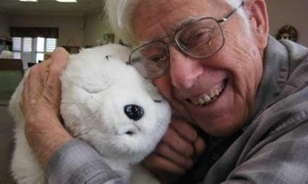
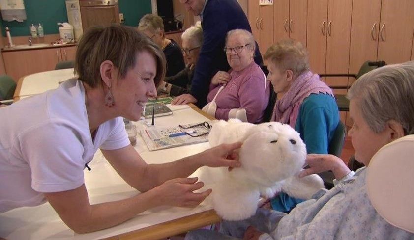

Eenzaamheid, we hebben er allemaal wel eens last van, zeker nu ons land in de greep is van COVID-19. Een bevolkingsgroep die hier erg onder lijdt zijn de ouderen. Zij zitten met een beetje pech de hele dag alleen op hun kamer omdat er niemand op bezoek kan en mag komen. Ook voor de huidige pandemie was eenzaamheid onder bejaarden een groeiend probleem. Zo blijkt uit onderzoek dat in 2018 meer dan de helft van de ouderen boven de 75 jaar zich eenzaam voelde. De gevolgen van deze stijgende lijn zijn enorm. In verschillende onderzoeken wordt aangetoond dat er een verhoogde kans is om Alzheimer te krijgen, maar ook depressie en suïcide kunnen een repercussie zijn van te weinig sociaal contact. Dat wil natuurlijk niemand. Er zijn zo nog veel meer voorbeelden te noemen, maar in dit artikel draait het vooral om een mogelijke oplossing voor dit ernstige probleem; robotdieren. Robotdieren zijn misschien niet het eerste waar men aan denkt als het gaat om de strijd tegen eenzaamheid, maar in landen als Japan wordt er al veel gebruik van gemaakt. Het lijkt misschien een vreemd idee, maar toch zitten er veel voordelen aan vast. Alleen wat moet je je nou eigenlijk voorstellen bij zo’n robotdier, hoe werkt het en waarom zou je niet simpelweg voor een echt dier kiezen? 
 

Robotdieren hebben in het begin van de 21e eeuw een exponentiële ontwikkeling doorgemaakt en kunnen een groot aandeel hebben in het oplossen van eenzaamheid onder ouderen. Twee van de best ontwikkelde robotdieren die momenteel op de markt zijn heten ‘Paro’ en ‘AIBO’. Paro is een kleine robotzeehond met een witte vacht en hij weegt ongeveer 2,8 kg. Paro heeft vier types sensoren die hij gebruikt om interacties aan te 
gaan met mensen; lichtsensoren, geluidssensoren, evenwichtssensoren en Paro tastsensoren. AIBO is een entertainment robot in de vorm van een hond. Ook AIBO heeft vier sensoren: Tast, zicht, geluid en balans. Net als een echte hond kan AIBO wandelen en spelen, namen herkennen en commando’s uitvoeren. Door gebruik te maken van al deze sensoren kunnen deze robotdieren reageren op hun omgeving en een band vormen met mensen. 
 

De robotdieren hebben verschillende positieve effecten op ouderen. In aanwezigheid van zo’n robotdier neemt de stemming van ouderen flink toe. Mentale klachten als depressie kunnen afnemen. De ouderen gaan de robots zien als ware het hun eigen kind waar ze voor moeten zorgen en dus ook van gaan houden. Praten en lachen doen ouderen met hun nieuwe maatje het meeste. Al snel tovert zo’n lieve robotdier een vrolijke uitdrukking op vele gezichten. Bovendien hebben de robots ook een positieve werking op gemeenschappen. Ze werken namelijk als een soort ijsbreker en stimuleren ouderen om meer met elkaar te kletsen. Mede daarom worden ze tegenwoordig veel ingezet in verzorgingstehuizen. De sfeer in een verzorgingstehuis wordt vaak beduidend beter en relaxter. Daarnaast bleven de ouderen in aanwezigheid van de robot langer in de gemeenschappelijke ruimte zitten. Ook zijn de robotdieren een goede aanvulling op de zorg aangezien de ouderen minder aandacht vragen van de zorgmedewerkers en zij door de robots gedeeltelijk ontlast worden. 
Knuffeldieren worden ook regelmatig in de zorg gebruikt. De robots zijn in vergelijking met de knuffels wel duurder, maar zorgen dan ook een stuk vaker voor een positieve verandering in 
emotie bij ouderen. Bovendien verminderen robotdieren de eenzaamheid even effectief als een echt dier. Ze zijn dus erg geschikt voor ouderen die geen echt huisdier kunnen hebben en verzorgen maar wel op zoek zijn naar gezelschap. 
 
Robotdieren hebben dus de potentie om veel goeds te doen voor de ouderen. Ze kunnen helpen tegen mentale problemen en kunnen tegelijkertijd ook de sociale vaardigheden van de ouderen verbeteren. Met name voor ouderen die zelf niet in staat zijn om voor een echt huisdier te zorgen lijkt dit de ideale oplossing. Of het gebruik van deze robotdieren genoeg is om de eenzaamheid onder ouderen te verhelpen is niet zeker, maar het is wel degelijk een stap in de juiste richting. 
 
 24 januari 2021 
