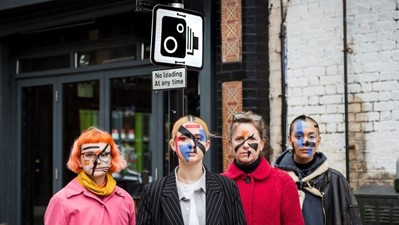
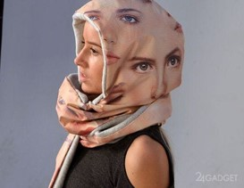
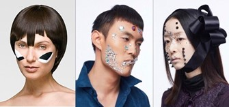
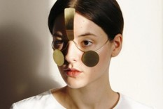

Gezichtsherkenningssystemen worden steeds vaker ingezet om criminelen mee op te sporen. In China gaat het zelfs een stapje verder. 	Daar 	hangen 	naar schatting 176 miljoen CCTV camera’s op openbare plekken. De software van die camera’s is in staat om 1.3 biljoen inwoners te 	herkennen 	binnen 	drie seconden. Ook verouderde of gedeeltelijk 	verborgen gezichten - denk maar aan mondkapjes- kunnen geïdentificeerd worden. Alleen al de dreiging op constante surveillance heeft al een huiveringwekkend effect op mensen. Er is dan momenteel ook een maatschappelijk debat gaande over gezichtsherkenning en de mogelijke schending van privacy. De ene partij vindt dat gezichtsherkenning op openbare plekken toegestaan moet zijn en de andere partij vindt dat het een grote inbreuk is op onze rechten en vrijheden. Timnit Gebru, een leider van het artificiële intelligentie team van Google, legt uit waarom gezichtsherkenning te gevaarlijk is om zelfs voor de wetshandhaving in te zetten: 
Ik trof zeer grote verschillen in foutenpercentages aan [in gezichtsherkenningssystemen], vooral tussen lichtere mannen en vrouwen met donkere huidskleur. 

Dat gezichtsherkenning vooringenomenheid vertoont, betekent des te meer reden om deze systemen niet te accepteren. Momenteel zijn er steeds meer activisten die zich verzetten tegen het gebruik van gezichtsherkenning. Zij samen met verschillende kunstenaars en wetenschappers hebben uit vorm van verzet manieren bedacht om deze technologieën te slim af te zijn. Hieronder lees je 4 methodes om onder de radar te kunnen blijven: 
 
# 1. Gooi de hoed, sjaal en zonnebril weg  

Gezichtsherkenning is een biometrische techniek. Dat wil zeggen een techniek gebaseerd op unieke kenmerken van het gelaat. Wanneer het gezicht in beeld is gedetecteerd, worden kenmerken van het gezicht vergeleken met die van gezichten uit de database. Vaak wordt hierbij gebruik gemaakt van artificiële intelligentie (AI). Het systeem maakt dan zijn eigen herkenningspatroon op basis van een combinatie van eigenschappen. Door gebruik te maken van artificiële intelligentie kan software nu door sluwe vermommingen heen kijken. Amarjot Singh, onderzoeker aan de Universiteit van Cambridge heeft een algoritme getraind om veertien belangrijke gezichtspunten te lokaliseren zelfs als ze niet te zien waren. Handmatig labelde hij 2000 fotos van mensen met hoeden, brillen, sjaals en nepbaarden.

# 2. Foto’s worden aangezien voor echte personen
 
Een zwakte bij gezichtsherkenning met behulp van AI is herkennen wanneer een gezicht een foto is. Het Vietnamese Bachkhoa Internetwork Security Centre of 	Bkis 	demonstreerde 	dat gezichtsherkenningssoftware van laptops misleid kan worden. Medewerkers lieten zien dat zij met behulp van een geprinte foto van een legitieme gebruiker toegang konden krijgen tot een laptop. Ook een foto die was gemaakt met de ingebouwde webcam van de laptop, nadat er eenvoudige manipulaties op waren toegepast, bleek genoeg om de software voor de gek te houden. Men kan hier gebruik van maken door bijvoorbeeld gezichten te printen op kledingstukken om de algoritmes van de gezichtsherkenningssoftware in de war te brengen. Dit wordt de Hyper-face techniek genoemd. 

# 3. Kies unieke haarstijlen en make-up

Een andere manier om de software te omzeilen is door gebruik te maken van het 3D-geprinte siliconen URME Surveillance-masker. Daarnaast wordt ook gebruik gemaakt van ‘CV Dazzle’ make-up. CV Dazzle make-up verstoort de symmetrie van het gezicht door donkere kleuren op lichte delen van het gezicht te plaatsen en vice versa. Met haarstijlen worden de ogen en de vorm van het gezicht deels verborgen. Make-up om een persoon ouder te laten lijken werkt vaak ook goed om de algoritmes te misleiden. Online zijn talloze instructies te vinden over hoe men deze make-up kan

# 4. Draag slimme gezichtssieraden 

Langzamerhand worden er ook gezichtssieraden ontworpen die gezichtsherkenning tegengaan. Het Japan National Institute of Informatics introduceerde brillen uitgerust met LED lampen die de ogen en de neus verlichten. Dit misleidt het systeem en de persoon wordt als het ware ‘onzichtbaar’. Er wordt tegelijkertijd een baseballcap ontwikkelt waarbij het vizier uitgerust is met infraroodsensoren waardoor de infraroodcamera’s de referentiepunten op het gezicht niet nauwkeurig kunnen lezen. Een misschien wat meer simpele uitvinding is een soort gezichtssieraad wat reflecteert waardoor de persoon niet geïdentificeerd kan worden. Je valt met zo’n sieraad natuurlijk wel heel erg op. 

Kortom, er zijn heel wat leuke, slimme en creatieve oplossingen om gezichtsherkenning met behulp van artificiële intelligentie te omzeilen. Een minpunt aan deze bevindingen is wel dat ze meestal erg excentriek zijn en je dus toch wel zal opvallen als je over straat loopt met bijvoorbeeld unieke make-up of een reflecterend gezichtssieraad.  
