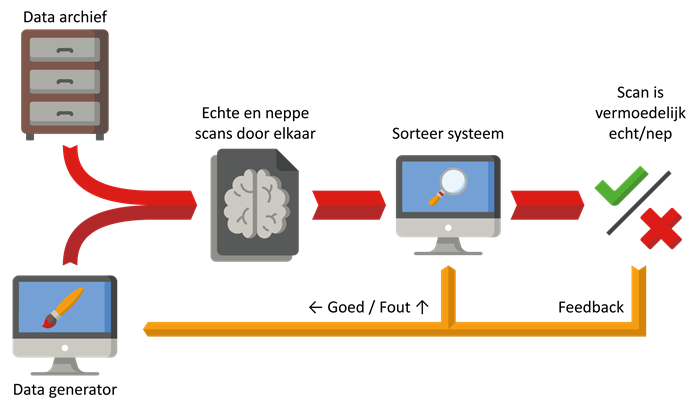

In 2021 zullen ongeveer 85.000 mensen gediagnosticeerd worden met een hersentumor. Ongeveer de helft van die mensen zal 8 maanden na deze diagnostisering overleden zijn. Het is dus van groot belang om zo snel en goed mogelijk hersentumoren te herkennen. Doktoren vinden hersentumoren door middel van medische beeldvorming zoals MRIscans en CT-scans. Zij kunnen in dergelijke scans soms plekjes vinden die anders zijn dan normaal, maar dat is erg lastig. Zo weten chirurgen voor de operatie in de meeste gevallen niet om wat voor tumor het gaat. 

Artificiële Intelligentie kan helpen met het aflezen van medische beeldvorming. Zo bestaat er AI die kan bepalen of er een tumor te zien is en, zo ja, wat voor type tumor het is. Daarnaast kunnen andere AI’s precies zeggen waar de tumor plaatsvind. Met een goede AI kan er binnen een paar minuten een diagnose, mét gespecificeerde soort tumor zijn. Er wordt dus niet meer over tumoren heen gekeken. 

Een groot probleem met zo’n AI is dat het niet zomaar werkt. Voordat het werkt moet de AI getraind worden om bepaalde patronen te herkennen, en om te trainen heeft het een enorme hoeveelheid scans nodig. Hoe meer scans, hoe beter het werkt. Bij het maken van een AI voor medische beeldvorming gaat wel de helft van de tijd naar het verkrijgen en verbeteren van scans om mee te trainen. Hoewel op het moment de hoeveelheid beschikbare scans stijgt, gaat dit niet in een snel genoeg tempo om de AI’s gedurende langere periode te kunnen blijven ‘voeden’ met scans om mee te trainen: Dit is hét probleem waar Generative Adverserial Networks de oplossing van kunnen zijn. 

Een Generative Adverserial Network, ofwel GAN, kan gebruikt worden als hulpbron voor het verkrijgen van geschikte scans om AI’s mee te trainen. Een GAN kan namelijk sprekend echt lijkende scans maken uit het niets. Hoe doet het dat? 

Een GAN bestaat uit twee AI’s die elkaar trainen: een datagenerator en een sorteersysteem. De datagenerator maakt nep scans aan. De eerste nep scans zijn dan altijd willekeurige onzin omdat de datagenerator nog niet getraind is. Vervolgens worden de nep scans samen met echte scans op een hoop gegooid. Hierna moet het sorteer systeem voor elke scan op de hoop achterhalen welke nep, en welke echt is. Wanneer de hoop gesorteerd is wordt per scan gekeken of het sorteersysteem het goed of fout had.  

Als het sorteersysteem een scan fout heeft gesorteerd dan probeert het sorteersysteem daar van te leren door zichzelf aan te passen zodat die volgende keer niet de zelfde vergissing maakt. Als daarentegen het sorteersysteem een scan correct als nep heeft gesorteerd dan heeft de datagenerator blijkbaar gefaald in het namaken van echte scans. De datagenerator probeert daar dan van te leren door iets anders te proberen bij het maken van de volgende scans. 

Dit hele proces wordt herhaald totdat de nep scans voor het sorteersysteem niet meer te onderscheiden zijn van echte scans. De scans die de datagenerator maakt zijn nu dusdanig realistisch dat ze gebruikt kunnen worden voor het trainen van andere AI’s. En zo kunnen GAN’s het gebrek aan scans voor het trainen van AI’s oplossen. 

Als men kijkt naar de groeiende hoeveelheid mogelijkheden van deze automatisch-data-genererende AI’s, zou het voor meer dan alleen de diagnostiek van hersentumoren een veelbelovende ontwikkeling kunnen zijn: Je kunt GAN’s als deze namelijk vrijwel alle soorten data laten genereren! 
