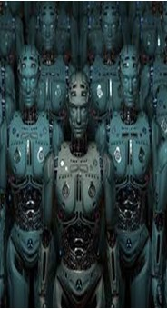
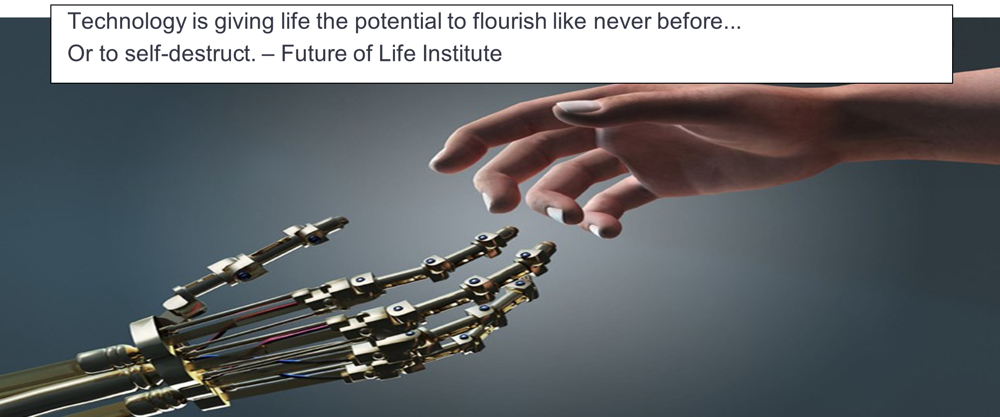

 

Science fiction scenario’s beginnen
werkelijkheid te worden, het is niet meer
alleen in films dat de mensheid met
uitroeiing wordt bedreigd.

Ten minste, dat is waar een groot aantal
vooraanstaande wetenschappers ons voor
probeert te waarschuwen.

Elon Musk, bijvoorbeeld, doneerde 10
miljoen dollar aan het ‘Future of Life
Institute’ om onderzoek te doen naar hoe
we kunnen voorkomen dat AI zich ooit
tegen ons keert. Ook andere invloedrijke
mensen zoals Stephen Hawking en Bill
Gates uiten hun zorgen en zeggen dat de
technologie ons wel eens allemaal om zeep
kan gaan helpen. Een serieuze zaak dus!

Een van de toepassingen van kunstmatige
intelligentie waar veel discussie over is, zijn
autonome wapensystemen of de
zogenaamde killer robots. Dit zijn systemen
die volledig zelfstandig opperen om
doelwitten te selecteren en uit te schakelen.
Menig is tegen deze ontwikkelingen, men
vindt het onethisch en onacceptabel.

Maar zijn de grote zorgen over deze killer
robots echt nodig? Laten we wat feiten
boven water halen: In deze blogpostzullen
er een aantal argumenten besproken
worden tegen het gebruik van de
wapensystemen en enkele
voorargumenten. 

# Verantwoordelijkheid

Laten we beginnen met de
tegenargumenten. Het eerste probleem is
namelijk dat killer robots moeten worden
aangeleerd om onderscheid te kunnen
maken tussen burger en soldaat. Dit
onderscheid is vaak voor mensen al lastig
te maken. Het systeem is wel in staat om dit
onderscheid te leren, maar in praktijk blijkt
vaak dat het systeem nog veel fouten
maakt.

Daarnaast is er een groot probleem op het
moment dat de killer robot een foute
beslissing maakt, want wie is er dan
verantwoordelijk? Het is niet duidelijk of
deze verantwoordelijkheid ligt bij de
programmeurs of bij de mensen die de killer
robots inzetten. Zolang dit onduidelijk is, is
men van mening dat deze systemen
eigenlijk niet kunnen worden ingezet.

# Wapenwedloop

Het gebruik van killer robots zou tot een
nieuwe wapenwedloop kunnen leiden.
Zeker als we kijken naar de nucleaire
wapenwedloop van de Koude Oorlog is het
ontstaan van wapenwedloop door killer
robots niet eens zo’n heel gek idee. Beide
maken namelijk gebruik van een
ingewikkelde technologie.

Ook springen er duidelijk landen boven uit
die meer voordeel hebben bij het
ontwikkelen van deze twee wapens. Zo
zouden landen als de VS, Rusland en China
de meest kans hebben op een voorsprong
in gebruik van deze killer robots.
Daarnaast verandert de strategie van oorlog
voeren. Dit zorgt allemaal voor veel angst
en weerstand.

Om daar nog aan toe te voegen weten we
maar al te goed van de geschiedenis dat
wapens de wereld niet altijd veiliger hebben
gemaakt. Zolang er wapens tot beschikking
zijn, blijft het risico aanwezig dat deze
gebruikt gaan worden. Ook bij killer robots
zou dit het geval kunnen zijn.

# Beslissingsvermogen

Er worden er ook voordelen genoemd voor
het gebruik van autonome wapensystemen.
Een daarvan is dat (killer)robots in het
algemeen niet beïnvloed worden door
geestelijke of fysieke factoren. Hierdoor zijn
robots in staat om sneller een betere
beslissing te nemen.

Aan de andere kant heeft het
beslissingsvermogen van (killer)robots ook
nadelen. Zo kunnen killer robots zich niet
snel aanpassen aan veranderingen in de
omgeving. Hierdoor wordt de kans op
ongelukken vergroot, wat weer ethische
vragen met zich mee brengt. Het is daarom
voor het veilig gebruiken van killer robots
van belang dat de mens moet kunnen
ingrijpen, die op basis van morele en
juridische redenen een goede afweging kan
maken.

Doordat killer robots te maken krijgen met
vele ethische dilemma's is het van belang
dat bekend is hoe killer robots hier mee
omgaan en hoe dit geprogrammeerd moet
worden.

# Minder eigen verlies

Een ander punt dat voorstanders van LAWS
vaak maken, is dat het voor minder verlies
zorgt in de eigen rangen. Dit berust zich op
het feit dat de systemen ingezet kunnen
worden, zonder dat hierbij mensen van de
pas komen. Dit zorgt er logischerwijs voor
dat er minder verlies is bij eigen soldaten,
omdat deze bij een aanval bijvoorbeeld niet
gebruikt worden.

# Een conclusie? Die mag u zelf trekken.

Is het wel ethisch? Is het überhaupt nodig?
Staan wij het zomaar toe dat beslissingen
autonoom door dit soort systemen genomen
worden? Eenmaal kijkend weer op de
discussie, kan er geconcludeerd worden dat
er, bij gebruik van de juiste argumenten, bij
beide punten men zich kan aansluiten. Daar
komt bij dat in deze post ook niet ieder
mogelijk argument is behandeld. We zullen
met z’n allen moeten wachten op het
moment dat we de uitkomsten met eigen
ogen kunnen zien...

