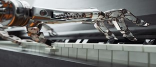

Probeer eens in je dagelijks leven om je heen te kijken en iets te vinden dat nog niet is beïnvloed door computers. Kunstmatige intelligentie (AI), machines die menselijke intelligentie nabootsen, worden beter en beter. Computerprogramma’s behalen steeds grotere en eens ondenkbare prestaties. Een van die prestaties is niet meer ondenkbaar, want op dit moment is niet meer alleen de mens in staat om muziek te kunnen maken. ‘AI muziek’ is muziek die helemaal is gecomponeerd door het computerprogramma zelf.  Het ‘Sony CSL Music Team’ uit Parijs ontwikkelde een AI systeem dat in staat is en nummer te maken in de stijl van ‘The Beatles” genaamd “Daddy’s car”. Het nummer van het ‘Sony CSL Music Team’ veranderde de mogelijkheden in de hedendaagse muziekwereld. De komst van AI muziek is groot, maar hoe wordt het dan gemaakt? Hoe reageren we op AI muziek als mensheid en wat staat ons nog te wachten? 
 
Hoe kan een computer tot zo een indrukwekkende prestatie als muziek maken in staat zijn? En hoe komt het dat het nummer “Daddy’s car” zo menselijk klinkt? Dat gaan we je uitleggen. Een computer moet je zien als een soort blank slate die zelf niks kan, maar wel alles kan leren. Helaas gaat dat leren niet zoals wij dat bij mensen gewend zijn. Het zit namelijk zo: de computer is eigenlijk een slimme na-aapmachine. Om een computer muziek te laten maken in de stijl van de Beatles, voerde het team de computer een grote dataset aan nummers van de band. Vervolgens lieten ze de computer alle nummers analyseren om verschillende aspecten patronen te herkennen. Deze patronen nam de computer tot zich en gebruikte deze om daarmee nieuwe muziek te produceren die daarmee eigenlijk een soort product is van de nummers die erin zijn gestopt. Zo komt het dat deze muziek sprekend op die van de Beatles lijkt! Zo’n zelflerend programma wordt ook wel een Deep Neural Network genoemd, gebaseerd op de manier waarop het brein leert. 

De meningen over AI, die muziek kan maken, zijn verdeeld. Zo speelt bij veel artiesten de angst dat de, op dit moment al te volle muzieksector, straks nog voller wordt. Sommige experts vrezen daarnaast dat muziek zijn diversiteit verliest als AI een steeds grotere rol gaat spelen in het creëren van muziek. Vincent Koops noemt het gevaar dat de muziek eenduidig westers getint zou kunnen worden als mensen dezelfde datasets gaat gebruiken. AI kan namelijk alleen op basis van de dataset iets nieuws maken en niet zelf iets nieuws verzinnen met een hele andere smaak. 

Dit is echter niet altijd het geval bij het gebruik van datasets. Ze kunnen namelijk ook juist zorgen voor een verbreding van de creativiteit in de muzieksector. Op het moment dat de datasets zelf worden samengesteld met onverwachte combinaties, komen de gekste nieuwe combinaties tevoorschijn. Nummers die een combinatie zijn van klassieke muziek en hiphop kunnen de normaalste zaak van de wereld worden. Ook nieuwe muziek van je favoriete, maar inmiddels overleden, artiesten valt straks te realiseren.  

Voorlopig staat muziek gemaakt door AI nog in zijn babyschoentjes en zijn nog veel dingen onduidelijk. Wie krijgt bijvoorbeeld de rechten rondom deze nieuwe muziek? En worden menselijke muzikanten ooit overbodig? Maar dat zijn vraagstukken voor later. Voor nu hoeven de artiesten zich nog geen zorgen te maken, wij zijn nu vooral heel benieuwd wat de toekomst van AI muziek nog zal brengen.   
 